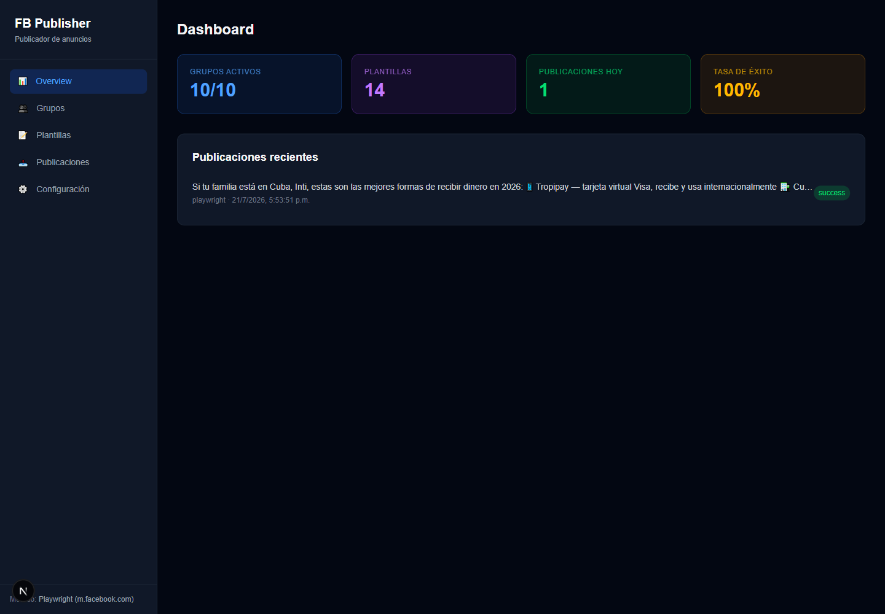
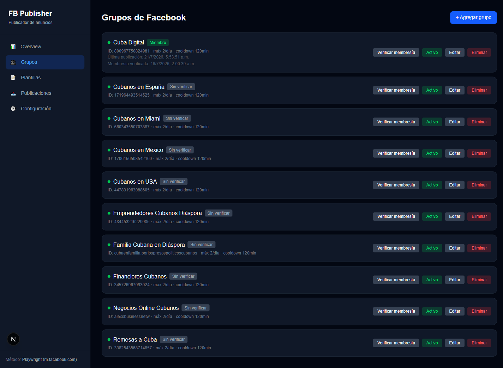
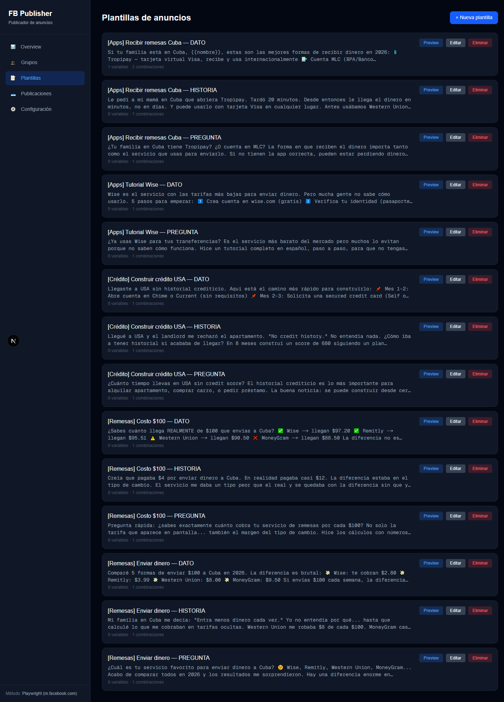
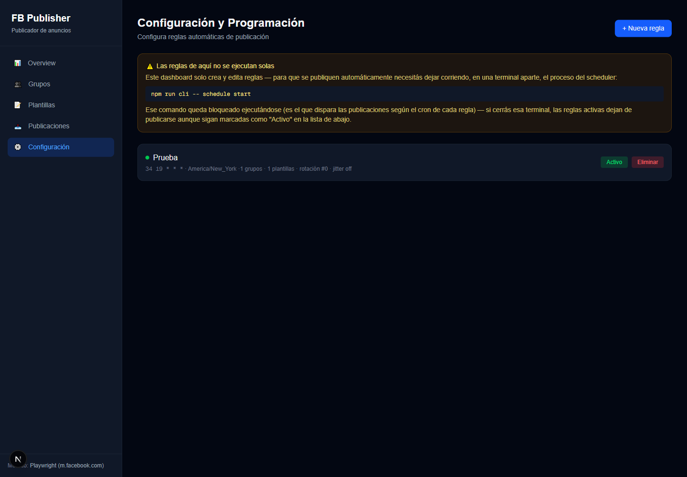
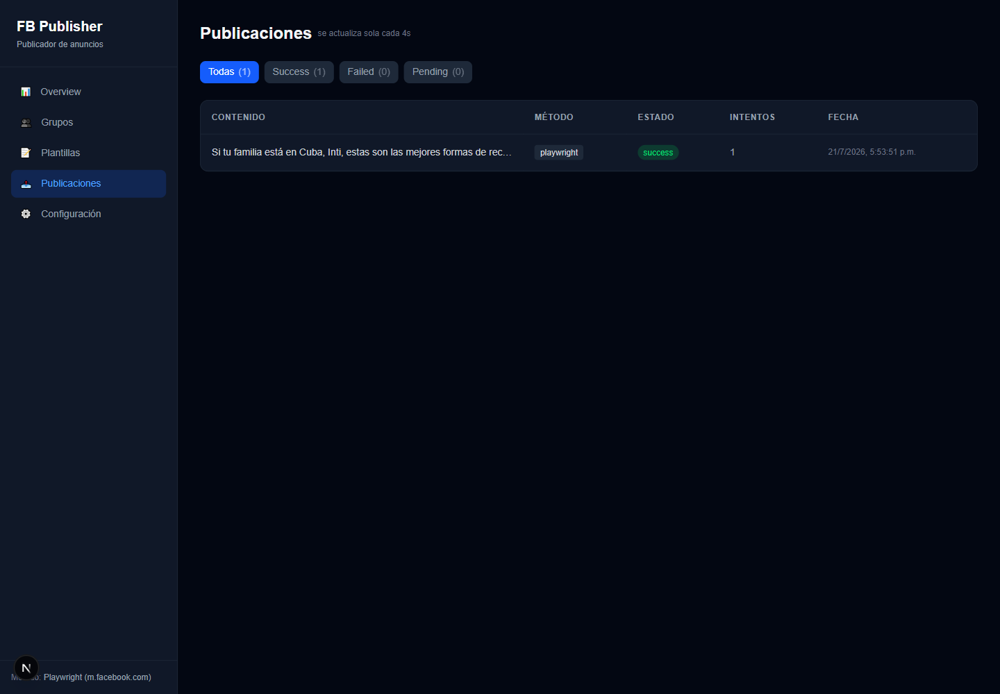

# FB Publisher

Herramienta para automatizar publicaciones en grupos de Facebook, con rotación determinista de contenido, dashboard web y CLI. Usa Playwright contra `m.facebook.com` (la versión móvil ligera de Facebook) para publicar sin depender de la API oficial de grupos de Facebook, que Meta restringe fuertemente para este caso de uso.

> Documentación completa de uso: [MANUAL.md](./MANUAL.md)

## Capturas

| Dashboard | Grupos |
|---|---|
|  |  |

| Plantillas | Programación |
|---|---|
|  |  |

| Publicaciones |
|---|
|  |

## Características

- **Dashboard web** (Next.js) para gestionar grupos, plantillas, programación y ver historial de publicaciones — sin tocar código ni JSON.
- **CLI** para operar todo desde terminal (`login`, `groups`, `templates`, `publish`, `schedule`).
- **Rotación determinista de contenido**: cada plantilla admite variables (`{{producto}}`, `{{precio}}`, etc.) y el sistema recorre todas las combinaciones posibles antes de repetir — sin aleatoriedad, siempre reproducible.
- **Scheduler con cron**: reglas de programación por grupo/plantilla con expresiones cron o presets ("3x al día", "cada hora", etc.).
- **Verificación de membresía**: detecta si la cuenta ya es miembro de cada grupo antes de intentar publicar ahí.
- **Comportamiento anti-detección**: jitter aleatorio entre publicaciones, espaciado global mínimo, tope diario de cuenta, y tecleo con velocidad humana variable — para no verse como actividad de bot. Ver [sección 12 del manual](./MANUAL.md#12-evitar-detección-como-actividad-sospechosa).

## Stack

- [Next.js 16](https://nextjs.org) (App Router) + React 19 + Tailwind CSS 4
- [Playwright](https://playwright.dev) para automatización de navegador
- [better-sqlite3](https://github.com/WiseLibs/better-sqlite3) para persistencia local
- [node-cron](https://github.com/node-cron/node-cron) para el scheduler

## Instalación rápida

```bash
npm install                # instala dependencias y descarga Chromium (postinstall)
cp .env.local.example .env.local  # si no existe, crear y completar credenciales/config
npm run cli -- login       # abre un navegador para iniciar sesión manual en Facebook
npm run dev                # dashboard en http://localhost:3000
```

Ver la [guía completa de instalación y primer uso](./MANUAL.md#1-instalación-y-configuración) en el manual.

> **Nota:** crear reglas de programación desde el dashboard no las ejecuta solas — hace falta dejar corriendo aparte `npm run cli -- schedule start` (ver [sección 8 del manual](./MANUAL.md#8-programación-automática-scheduler)).

## Estructura del proyecto

```
fb-publisher/
├── data/                   # SQLite + sesión de Playwright (gitignored)
├── src/
│   ├── lib/
│   │   ├── db/              # SQLite y repositorios
│   │   ├── templates/       # Motor de plantillas determinista
│   │   ├── publishers/      # Publisher con Playwright + m.facebook.com
│   │   ├── scheduler/       # Programación con cron
│   │   └── cli/             # Interfaz de línea de comandos
│   └── app/
│       ├── api/              # API REST (Next.js routes)
│       └── dashboard/         # Interfaz web
└── MANUAL.md                # Manual de usuario completo
```

## Advertencia

Esta herramienta automatiza acciones sobre una cuenta real de Facebook mediante control de navegador (no la API oficial). Facebook puede cambiar la estructura de `m.facebook.com` sin aviso, y usar automatización de forma agresiva puede resultar en revisiones de seguridad o restricciones de la cuenta. Lee la sección de buenas prácticas del manual antes de programar publicaciones automáticas a gran escala.
